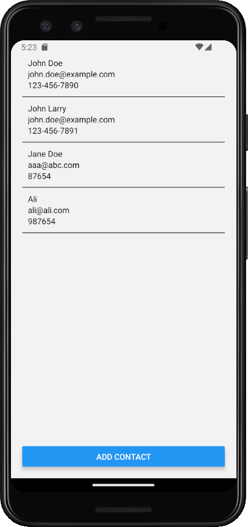
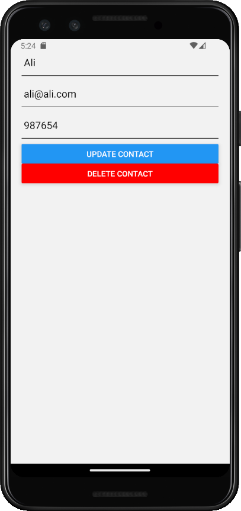
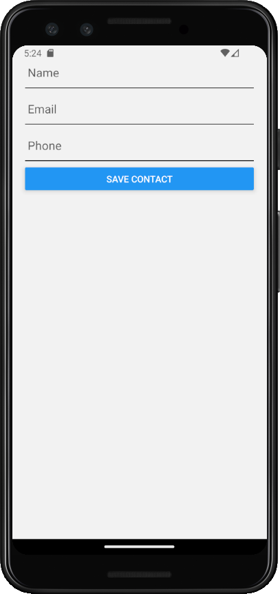

# Hello this is my app

-----------

## What is this app about?

A sample app to demonstrate the use of a RESTful web service. The app will allow users to view, add, edit, and delete contacts.

### Notable features of the app

The app will interact with a RESTful web service created using https://retool.com/api-generator

https://retoolapi.dev/3mPAvR/contact

Endpoints:

GET    /contact  
GET    /contact/:id  
POST   /contact  
PUT    /contact/:id  
PATCH  /contact/:id  
DELETE /contact/:id

----------- 

Screenshots of the app:

#resize image

Video walkthrough of the app:
https://www.youtube.com/watch?v=somevideoplaceholder

------------

Feel free to download this app to your phone:
Link to APK file of the app: [Download APK](./docs/app-release.apk)

